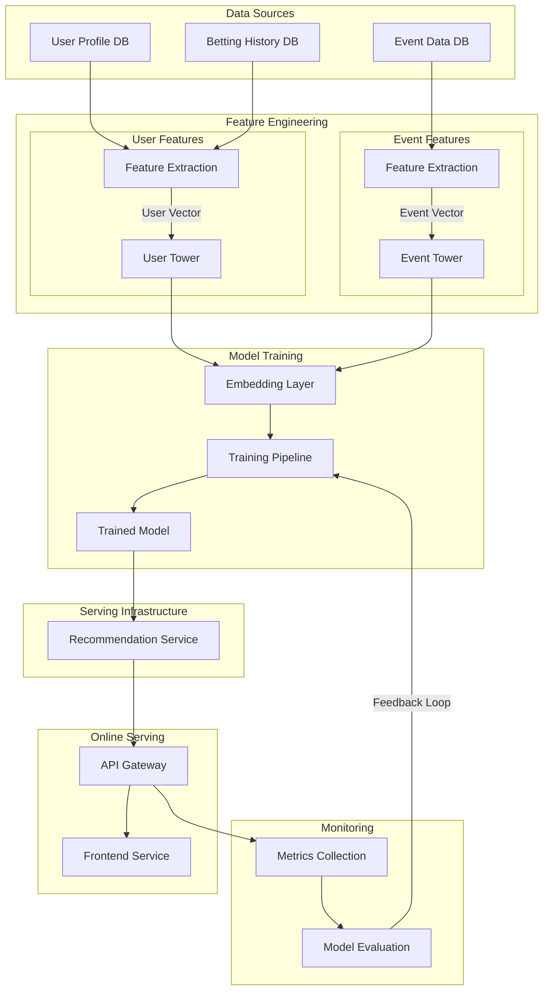

# Two-Tower Model for Betslip Recommendation
This repository implements a Two-Tower model for recommending sports betting selections and betslips. The model learns user preferences and betting patterns to suggest relevant betting opportunities.

## Architecture Overview
### Two-Tower Model

The key components of this architecture:

1. **Data Sources Layer:**
   - User Profile DB: Contains user demographics and preferences
   - Betting History DB: Historical betting patterns
   - Event Data DB: Sports events information

2. **Feature Engineering Layer:**
   - User Features:
     - Behavioral features (betting patterns)
     - Historical preferences
     - Demographic features
   - Event Features:
     - Event metadata
     - Market information
     - Historical performance

3. **Model Training Layer:**
   - User Tower: Processes user embeddings
   - Event Tower: Processes event embeddings
   - Embedding Layer: Creates unified representation
   - Training Pipeline: Model training and validation

4. **Serving Infrastructure:**
   - Recommendation Service

5. **Online Serving:**
   - API Gateway: Handles external requests
   - Frontend Service: Manages user interactions
   - User Interface: Presents recommendations

6. **Monitoring:**
   - Metrics Collection: Tracks performance
   - Dashboard: Visualizes metrics
   - Model Evaluation: Continuous assessment
   - Feedback Loop: Model retraining

The model consists of three main components:
- **User Tower**: Processes user features like betting history and preferences
- **Event Tower**: Processes event features like sport, league, and timing
- **Market Tower**: Processes market features like odds and market types

## Data Processing

Required input dataframes:
- `user_df`: User information and demographics
  - Columns: player_id, brand_id, player_reg_date, language
- `event_df`: Sporting event details
  - Columns: event_id, start_time, sport_id, league_id, home_team, away_team
- `bets_df`: Historical betting data
  - Columns: bet_id, player_id, event_id, market_id, amount, bet_odds, status
- `market_df`: Market information
  - Columns: market_id, odds

## Key Features

1. **Data Processing**:
   - Handles multiple selections per betslip
   - Processes categorical and numerical features
   - Handles missing values and feature normalization

2. **Model Architecture**:
   - Separate towers for different feature types
   - Attention mechanism for multiple selections
   - Embedding layers for categorical features

3. **Training**:
   - Balanced sampling for handling class imbalance
   - Early stopping and learning rate scheduling
   - Gradient clipping and regularization

4. **Recommendation Generation**:
   - Generates both single and multiple selection betslips
   - Applies odds and risk constraints
   - Provides confidence scores for recommendations

## Notes

- The model assumes that bet outcomes (win/loss) are available in the training data
- Proper scaling of numerical features is important for model performance
- Consider using GPU acceleration for large datasets
- Monitor class balance in the training data
- Validate odds and market availability before making recommendations

## Comparison of recommendation systems for betslip recommendations:

Here's a comparison of recommendation systems for betslip recommendations:

| Aspect | Two-Tower Model | Matrix Factorization (Traditional) | Content-Based Filtering (Traditional) | DCN v2 |
|--------|----------------|-----------------------------------|--------------------------------------|--------|
| **Architecture** | Dual neural networks for user and item features | Matrix decomposition into user and item factors | Feature similarity-based matching | Deep & Cross network with feature crossing |
| **Input Handling** | Separate processing of user/event features | User-item interaction matrix only | Item features and user preferences | Automatic feature interactions at different orders |
| **Feature Types** | Both categorical and numerical | Limited to interaction data | Rich feature support but manual engineering | Handles all feature types with automated crossing |
| **Scalability** | Good (O(n+m)) | Poor for large matrices (O(nm)) | Good (O(n)) | Very Good (O(n)) with feature reuse |
| **Cold Start** | Handles well through feature-based approach | Poor - needs interaction history | Good - uses only features | Good - learns from similar feature patterns |
| **Training Speed** | Moderate | Fast | Very Fast | Slow (complex feature crossing) |
| **Memory Usage** | Moderate | High (full matrix storage) | Low | Moderate to High |
| **Key Strength** | Balance of personalization and generalization | Works well with dense interaction data | Easy to implement and explain | Captures complex feature interactions |
| **Key Weakness** | Requires quality feature engineering | Sparsity issues | Can't learn complex patterns | Complex to tune and train |
| **Betslip-specific** | Natural handling of multiple selections | Difficult to handle multiple selections | Can use betting patterns but no learning | Good for odds and market interactions |
| **Inference Speed** | Fast | Fast after matrix factored | Very Fast | Moderate |
| **Interpretability** | Moderate (through embeddings) | Low | High | Low (complex interactions) |
| **Feature Importance** | Available through attention weights | Not Available | Directly visible | Available through feature crossing |
| **Updates** | Can be updated incrementally | Needs full retraining | Easy to update | Needs periodic retraining |
| **Practical Use** | Modern betting platforms | Legacy systems | Rule-based systems | Advanced betting platforms |

***

## Key Patterns to Look For:

### User Level Patterns:

- Betting frequency (bets per day/week)
- Preferred stake amounts
- Risk appetite (based on odds selection)
- Preferred bet types (singles vs accumulators)
- Time-based patterns (weekday vs weekend)

### Event Level Patterns:

- Most popular events/leagues
- Home vs Away team preference
- Correlation between odds and betting volume
- Peak betting times before event start

### Market Level Patterns:

- Most popular markets per sport
- Market preference by user segment
- Odds range distribution
- Success rate by market type

### BettingSpecificComponents:

* Odds handling
* Time sensitivity
* Market type handling
* Risk level encoding

